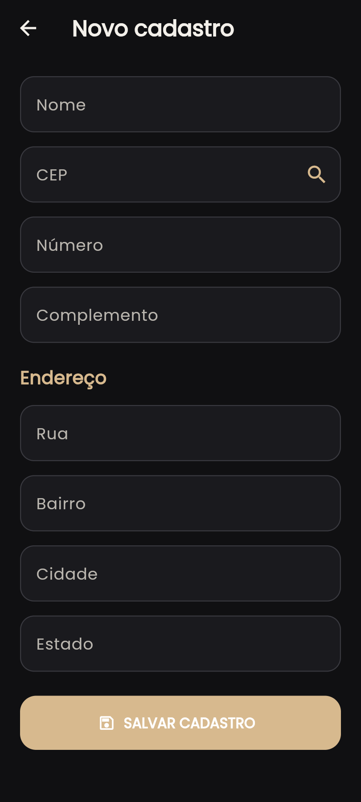
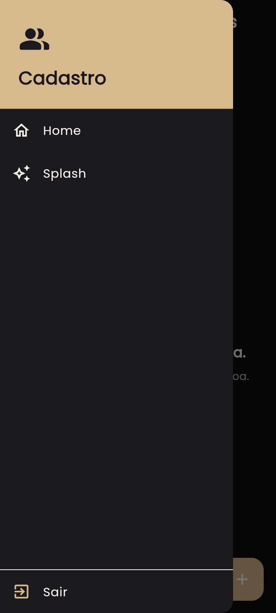

#  Cadastro de Pessoas

> Aplicativo mobile em Flutter desenvolvido para o **Desafio 01 da Aula 04 — Consumo de APIs Externas**, do curso de Programação para Dispositivos Móveis — SENAI.

---

## ✦ Sobre o projeto

Este projeto consiste em um aplicativo para **cadastro e gerenciamento local de pessoas**.

A aplicação utiliza a API pública **ViaCEP** para consultar informações de endereço automaticamente a partir do CEP informado pelo usuário.

A proposta desta versão foi desenvolver uma interface com estética **Dark Elegante**, utilizando uma combinação de tons escuros e detalhes dourados.

---

<<<<<<< HEAD
##  O que o aplicativo faz

### Cadastro

O usuário pode informar:

- Nome
- CEP
- Número
- Complemento

Após o preenchimento do CEP, os dados retornados pela ViaCEP são apresentados automaticamente:

- Rua
- Bairro
- Cidade
- Estado

Depois do cadastro, as informações são armazenadas localmente no dispositivo.

### Dados locais

Os cadastros utilizam **SharedPreferences**, permitindo que os dados continuem disponíveis mesmo após o aplicativo ser fechado e aberto novamente.

---

##  Navegação

O aplicativo possui as seguintes telas e recursos:

**Splash**
- Animação de entrada
- Animação de saída
- Acesso também pelo menu lateral

**Home**
- Exibição das pessoas cadastradas
- Menu lateral
- Botão `+` para novo cadastro

**Cadastro**
- Formulário de cadastro
- Consulta automática de CEP
- Salvamento dos dados

**Menu**
- Home
- Splash
- Sair

---

##  Identidade visual

A interface desta versão foi desenvolvida com uma proposta diferente da versão inicial do projeto.

### Direção visual

-  Interface predominantemente escura
-  Detalhes dourados
-  Cards e superfícies em tons de preto e cinza
-  Tipografia moderna
-  Layout adaptado para dispositivos móveis

---

##  Telas

### Splash


### Página inicial


### Cadastro



### Menu lateral


=======
-   Splash Screen com animação de entrada e saída
-   Tela Home
-   Menu lateral
-   Acesso à Splash pelo menu
-   Opção para sair do aplicativo
-   Botão `+` para adicionar uma nova pessoa
-   Lista de pessoas cadastradas

------------------------------------------------------------------------


##  Tecnologias utilizadas

| Tecnologia | Função |
|---|---|
| **Flutter** | Desenvolvimento mobile |
| **Dart** | Linguagem utilizada |
| **ViaCEP** | Consulta dos endereços |
| **HTTP** | Requisições para a API |
| **SharedPreferences** | Armazenamento local |
| **Google Fonts** | Tipografia |
| **Android Studio** | Emulação Android |
| **VS Code** | Desenvolvimento |

---

##  Integração com a ViaCEP

O aplicativo realiza uma requisição HTTP para a API ViaCEP utilizando o CEP informado no formulário.

A resposta da API é recebida em formato **JSON** e utilizada para preencher os campos de endereço.

Fluxo da consulta:

```text
CEP informado
      ↓
Requisição HTTP
      ↓
API ViaCEP
      ↓
Resposta JSON
      ↓
Rua • Bairro • Cidade • Estado
````

---

##  Armazenamento

Os dados cadastrados não dependem de um servidor próprio.

O aplicativo utiliza o armazenamento local do dispositivo por meio do:

```text
SharedPreferences
```

Dessa forma, os cadastros podem ser recuperados posteriormente no próprio aplicativo.

---

##  Organização

```text
flutter_desafio_1/
│
├── README.md
├── app-release.apk
├── pubspec.yaml
│
├── assets/
│   ├── icon.png
│   ├── 01-splash.png
│   ├── 02-home.png
│   ├── 03-cadastro.png
│   └── 05-menu.png
│
├── lib/
│
└── android/
```

---

##  Executando o projeto

### Requisitos

Antes de executar, é necessário possuir:

* Flutter instalado
* Dart
* Android Studio ou VS Code
* Emulador Android ou dispositivo físico

### Preparação

Clone o repositório:

```bash
git clone SEU_LINK_DO_GITHUB
```

Acesse o projeto:

```bash
cd flutter_desafio_1
```

Instale as dependências:

```bash
flutter pub get
```

Inicie o aplicativo:

```bash
flutter run
```

---

##  APK

Uma versão **Release** do aplicativo foi gerada utilizando:

```bash
flutter build apk --release
```

O APK está disponível diretamente na raiz do projeto.

### ⬇ Download

**[Baixar o APK](./app-release.apk)**

---

##  Proposta acadêmica

**Disciplina:** Programação para Dispositivos Móveis
**Aula:** 04 — Consumo de APIs Externas
**Desafio:** 01 — Aplicativo de cadastro de pessoas

O projeto foi desenvolvido como atividade prática envolvendo:

* Consumo de Web Service REST
* Requisições HTTP
* Método GET
* Manipulação de JSON
* Integração com API externa
* Persistência de dados em dispositivo móvel
* Programação orientada a objetos
* Desenvolvimento de interfaces em Flutter

---

##  Desenvolvimento

**Julia Novo**

Projeto acadêmico desenvolvido no **SENAI**.
