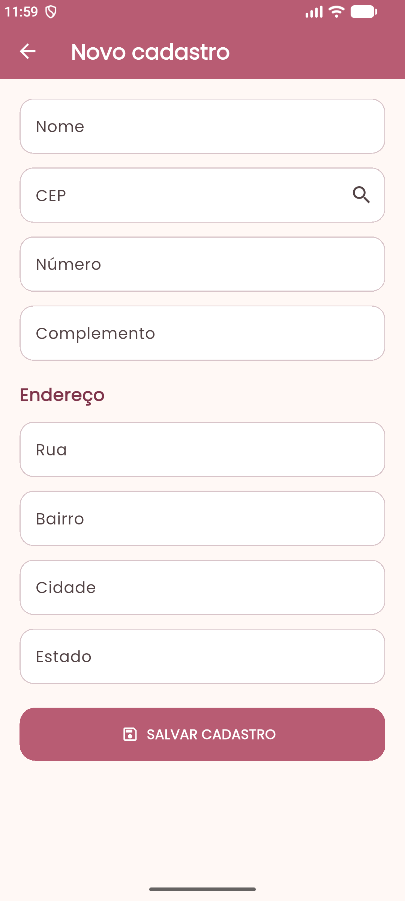
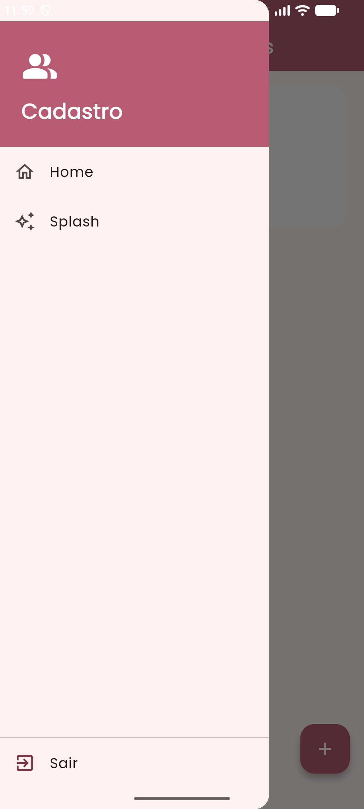

# Cadastro de Pessoas

Aplicativo mobile desenvolvido em **Flutter** para o **Desafio 01 ---
Aula 04: Consumo de APIs Externas**, da disciplina de Programação para
Dispositivos Móveis.

O aplicativo permite cadastrar pessoas, consultar automaticamente os
dados de endereço através da API ViaCEP e armazenar os cadastros
localmente no dispositivo.

------------------------------------------------------------------------

## Funcionalidades

### Cadastro de pessoas

-   Cadastro de nome
-   Cadastro de CEP
-   Cadastro de número
-   Cadastro de complemento
-   Consulta automática do CEP pela API ViaCEP
-   Preenchimento automático de Rua, Bairro, Cidade e Estado
-   Salvamento do cadastro localmente no dispositivo

### Navegação

-   Splash Screen com animação de entrada e saída
-   Tela Home
-   Menu lateral
-   Acesso à Splash pelo menu
-   Opção para sair do aplicativo
-   Botão `+` para adicionar uma nova pessoa
-   Lista de pessoas cadastradas

------------------------------------------------------------------------

## Interface

O aplicativo possui uma interface simples e intuitiva, com identidade
visual em tons de rosa e creme.

### Splash Screen


### Home


### Cadastro



### Menu lateral



------------------------------------------------------------------------

## Tecnologias

  Tecnologia          Utilização
  ------------------- ----------------------------------
  Flutter             Desenvolvimento do aplicativo
  Dart                Linguagem de programação
  ViaCEP              Consulta de endereços pelo CEP
  HTTP                Comunicação com a API
  SharedPreferences   Persistência local dos cadastros
  Google Fonts        Fonte da interface
  Android Studio      Emulação e execução
  VS Code             Desenvolvimento

------------------------------------------------------------------------

## API ViaCEP

O aplicativo utiliza a API pública **ViaCEP** para consultar os dados de
endereço a partir do CEP informado pelo usuário.

Ao preencher um CEP válido, o aplicativo realiza uma requisição para a
API e preenche automaticamente:

-   Rua
-   Bairro
-   Cidade
-   Estado

------------------------------------------------------------------------

## Persistência

Os cadastros são armazenados localmente utilizando
**SharedPreferences**.

Assim, os dados permanecem disponíveis após fechar e abrir novamente o
aplicativo.

------------------------------------------------------------------------

## Estrutura do projeto

``` text
flutter_desafio_1/
├── README.md
├── app-release.apk
├── pubspec.yaml
├── assets/
│   ├── icon.png
│   ├── 01-splash.png
│   ├── 02-home.png
│   ├── 03-cadastro.png
│   └── 05-menu.png
├── lib/
└── android/
```

------------------------------------------------------------------------

## Como executar

### Pré-requisitos

-   Flutter
-   Dart
-   Android Studio ou VS Code
-   Emulador Android ou dispositivo Android

### Instalação

Clone o repositório:

``` bash
git clone SEU_LINK_DO_GITHUB
```

Entre na pasta do projeto:

``` bash
cd flutter_desafio_1
```

Instale as dependências:

``` bash
flutter pub get
```

Execute o aplicativo:

``` bash
flutter run
```

------------------------------------------------------------------------

## APK

A versão final do aplicativo foi gerada em modo Release com:

``` bash
flutter build apk --release
```

O arquivo `app-release.apk` está na raiz deste repositório.

### Download

[Baixar APK](./app-release.apk)

------------------------------------------------------------------------

## Desafio

**Aula 04 --- Consumo de APIs Externas**

**Desafio 01 --- Aplicativo de cadastro de pessoas**

Projeto desenvolvido para a disciplina de Programação para Dispositivos
Móveis --- SENAI.

------------------------------------------------------------------------

## Autora

**Beatriz Albuquerque**
